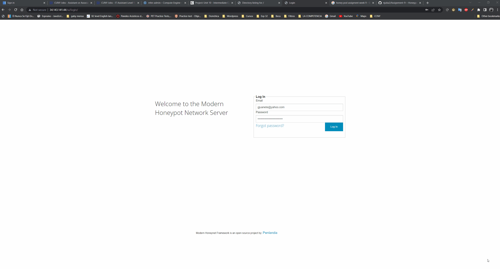
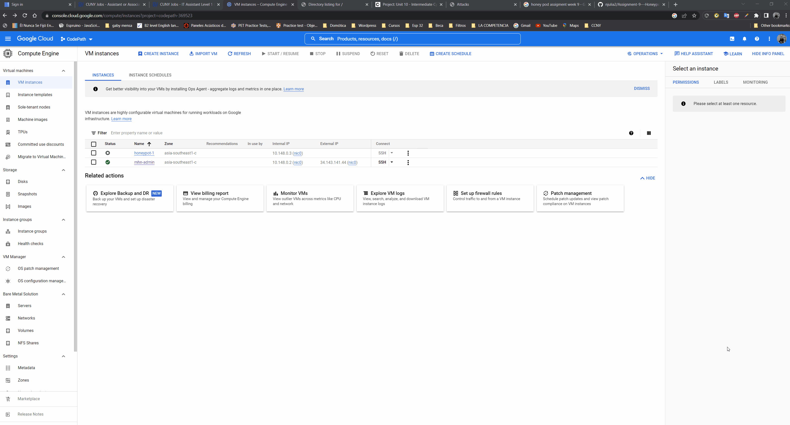
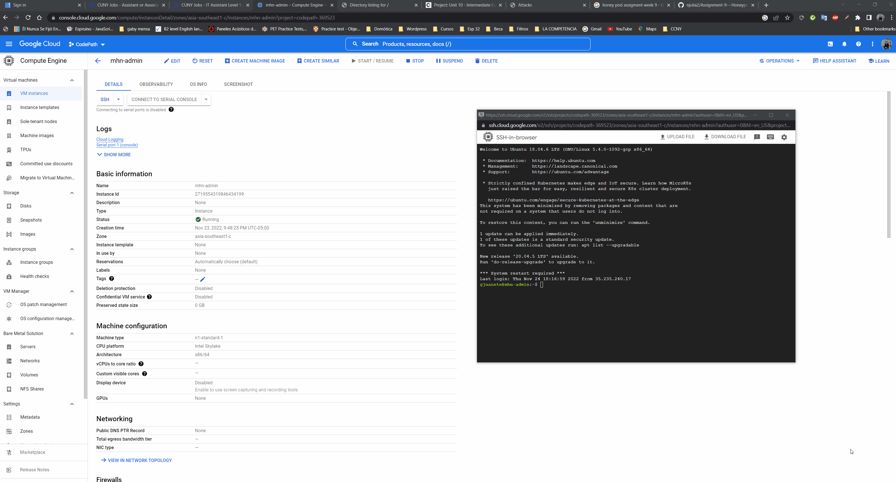

# Honeypot Assignment

**Time spent:** **10** hours spent in total

**Objective:** Create a honeynet using MHN-Admin. Present your findings as if you were requested to give a brief report of the current state of Internet security. Assume that your audience is a current employer who is questioning why the company should allocate anymore resources to the IT security team.

### MHN-Admin Deployment (Required)

**Summary:** How did you deploy it? Did you use GCP, AWS, Azure, Vagrant, VirtualBox, etc.?

MHN-Admin was deployed with google cloud engine vm instances, with the features below.

Ubuntu 18.04 Minimal
HTTP traffic allowed (port 80)
TCP ports 3000 and 10000

In addition it was necessary to create a firewall rule to open the port 3000 and 10000 to cnfigure properly.
Also SSH was established in the MHN Admin VM.

### Dionaea Honeypot Deployment (Required)

**Summary:** Briefly in your own words, what does dionaea do?

Dionaea is a honeypot used to test and capture intentionally several kinds of attacks. Dionaea is meant to be nepenthes successor, embeddings python as the scripting language.

### Database Backup (Required) 

**Summary:** What is the RDBMS that MHN-Admin uses? What information does the exported JSON file record?

The Json file has information relative to the attacks to the honeypot admin, json sile has information like , Id , protocol, port used , timestamp, etc.

*Be sure to upload session.json directly to this GitHub repo/branch in order to get full credit.*

## Notes

The lab was straightforward to follow, but getting the knowledge to understand every single step in the lab was quite difficult, GCP is one of the most recent technologies used for so many IT projects and it has a lot of uses, therefore is a little bit difficult to get to master a topic, due to the huge amount of information that there are to learn.

